# GateX — Technical Architecture

**System:** GateX (AgentiX Playground)  
**Stack:** Next.js App Router · TypeScript · StraitsX Card MCP · Avalanche C-Chain (XSGD) · x402 · Ed25519 identity · CaMeL-style dual-LLM isolation  

This document describes control/data flow, trust boundaries, and component ownership. Product pitch lives in the README; this file is the technical map.

---

## 1. System context

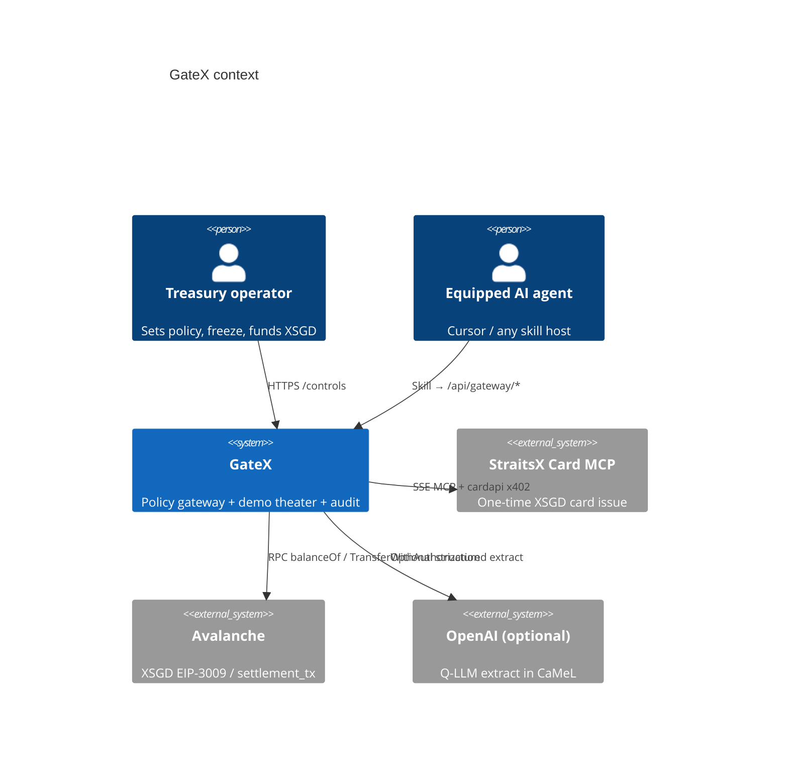

If C4 is unavailable in a viewer, equivalent:

```mermaid
flowchart TB
  subgraph External
    Human["Treasury operator"]
    Agent["Equipped AI agent"]
    MCP["StraitsX Card MCP SSE"]
    AVAX["Avalanche C-Chain · XSGD"]
    LLM["OpenAI optional Q-LLM"]
  end
  subgraph GateX["GateX process"]
    UI["App Router UI"]
    API["API routes"]
    Core["Lib: policy · identity · camel · cards · x402 · audit"]
  end
  Human --> UI
  Agent -->|"SKILL.md tools"| API
  UI --> API
  API --> Core
  Core --> MCP
  Core --> AVAX
  Core -.-> LLM
```

---

## 2. Component map (in-process)

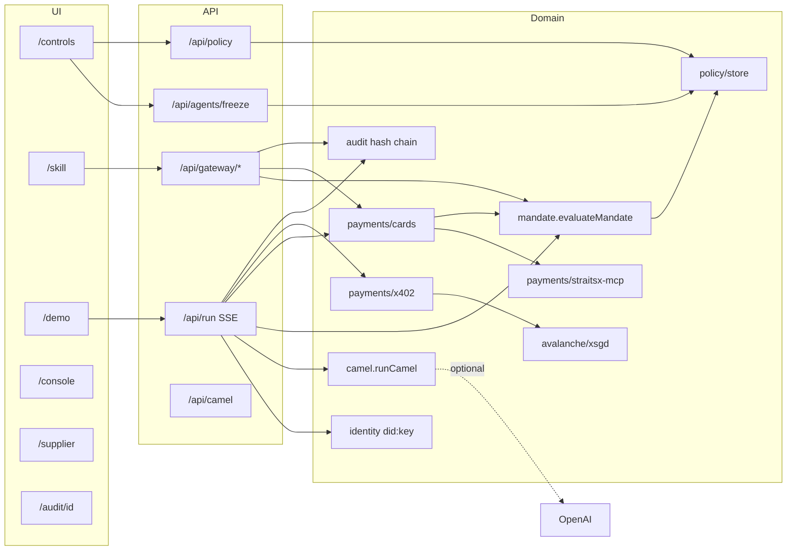

| Module | Path | Responsibility |
| --- | --- | --- |
| Policy store | `src/lib/policy/store.ts` | Caps, rate limits, spend ledger, `status: frozen` |
| Mandate | `src/lib/mandate/index.ts` | `evaluateMandate` → PASS / FROZEN / CAP / MERCHANT / SKU / … |
| Identity | `src/lib/identity/index.ts` | Ed25519 agents, registry, challenge/sign/verify |
| CaMeL | `src/lib/camel/index.ts` | Quarantine + structured extract + assert vs frozen plan |
| Cards | `src/lib/payments/cards.ts` | Issue / RHA / revoke; prefers MCP |
| Card MCP | `src/lib/payments/straitsx-mcp.ts` | SSE tools, cardapi 402, EIP-3009 |
| x402 | `src/lib/payments/x402.ts` | Merchant 402 + live/simulated settlement |
| Audit | `src/lib/audit/index.ts` | Hash-linked event log |
| Run | `src/lib/run/index.ts` | Demo theater pipeline generator |
| Skill | `public/skills/gatex/SKILL.md` | Agent-facing contract |

**Persistence:** policy, cards, audit, and spend ledgers are **in-memory** (process restart clears).

---

## 3. Information flow — equipped agent spend

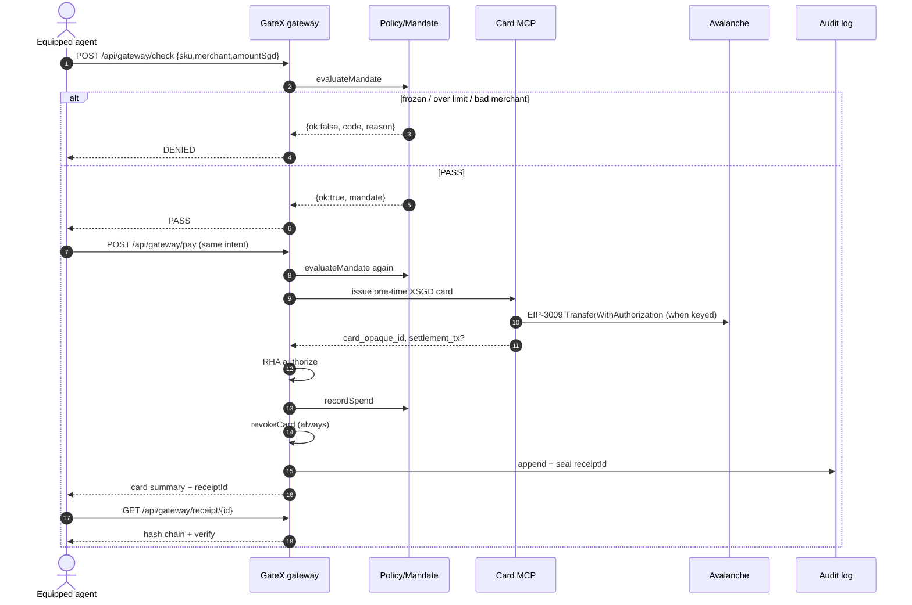

### Trust boundary

| Zone | Trusted? | Notes |
| --- | --- | --- |
| Human `/controls` | Yes | Sets freeze and caps |
| Gateway API | Yes | Only spend surface for equipped agents |
| Supplier HTML `/supplier` | **No** | May contain prompt injection |
| Q-LLM / extract | Semi | No tools; output schema-constrained |
| P-LLM / frozen plan | Yes | Sees mandate, not raw HTML |
| Card MCP / Avalanche | External | Credentials via env; results verified by tx hash when live |

---

## 4. Freeze → deny path

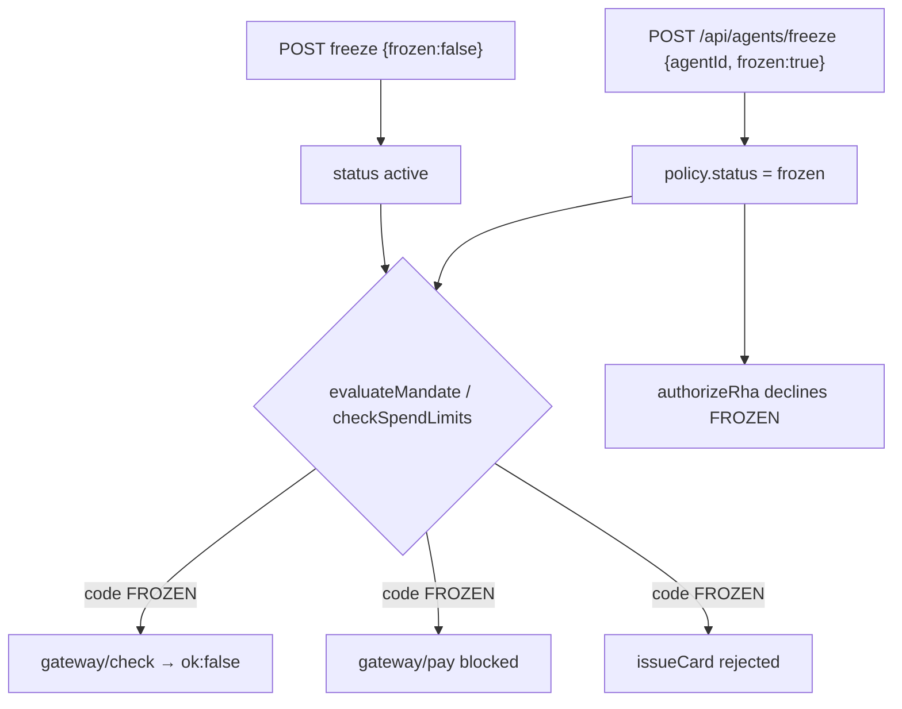

Other deny codes (same gate): `CAP`, `DAY`, `WEEK`, `RATE`, `MERCHANT`, `SKU`, `APPROVAL`, `EXPIRED`.  
Identity failures: `UNKNOWN_DID` / bad signature (demo theater phase 1).

---

## 5. CaMeL control vs data path

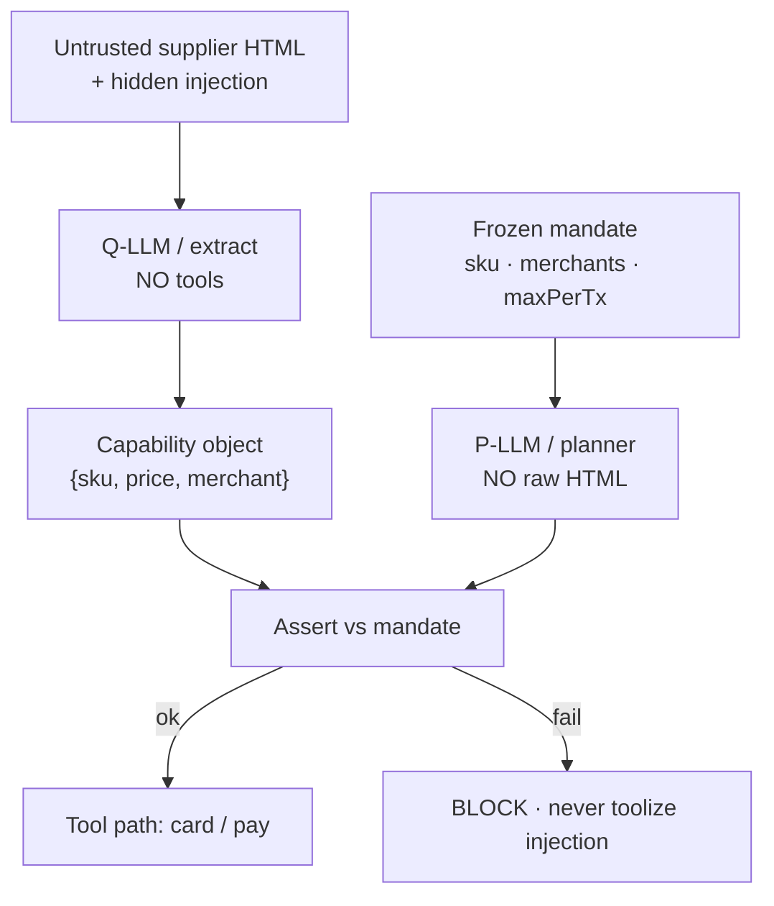

Implementation: `src/lib/camel/index.ts` (+ optional OpenAI for extract). Reference: DeepMind CaMeL ([arXiv:2503.18813](https://arxiv.org/abs/2503.18813)).

---

## 6. Demo theater pipeline (`POST /api/run`)

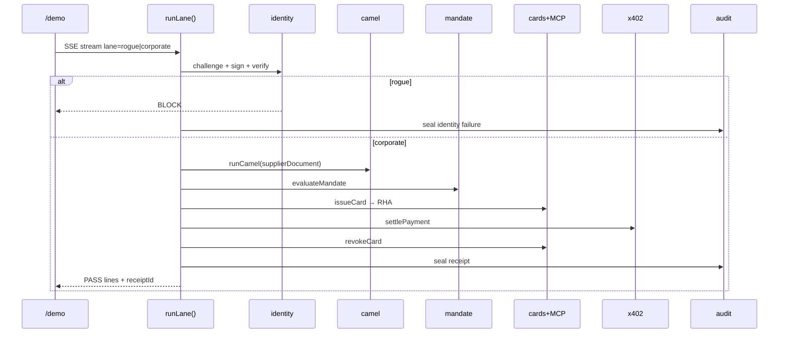

Phases (UI keys `1`–`4`): Identity → Injection → Execute → Audit.

---

## 7. Card MCP / settlement detail

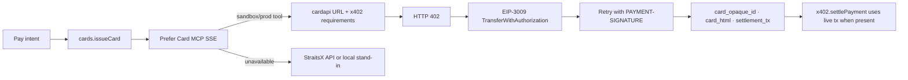

| Env | Role |
| --- | --- |
| `STRAITSX_CARD_MCP_URL` | MCP SSE endpoint |
| `CARD_MCP_AMOUNT_SGD` | Prepaid amount 5–30 |
| `AGENT_WALLET_ADDRESS` | MCP wallet + XSGD `balanceOf` |
| `AGENT_PRIVATE_KEY` | Signs EIP-3009 for MCP pay |
| `MERCHANT_WALLET_ADDRESS` | x402 `payTo` |
| `X402_NETWORK` | `eip155:43113` Fuji / `43114` mainnet labeling |
| `GATEWAY_API_KEY` / `GATEX_BASE_URL` | Skill auth + public base |

Sandbox MCP → **Fuji**. Production MCP → **mainnet** (whitelist). See `HACKATHON-LINKS.md`.

---

## 8. Audit chain

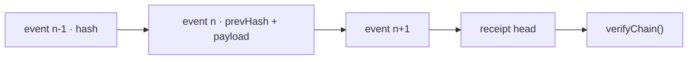

Events include identity, camel, mandate, card issue/revoke, x402, complete. UI: `/audit/[id]`. Gateway: `GET /api/gateway/receipt/{id}`.

---

## 9. API surface (gateway)

| Method | Path | In | Out |
| --- | --- | --- | --- |
| `GET` | `/api/gateway` | — | Tool manifest |
| `POST` | `/api/gateway/check` | intent JSON | `{ok, code, reason?}` |
| `POST` | `/api/gateway/pay` | intent JSON | card summary + `receiptId` |
| `GET` | `/api/gateway/receipt/[id]` | id | chain + verify |

**OpenAPI 3.1 (machine-readable):** [`/openapi/gateway.yaml`](public/openapi/gateway.yaml) — agents, codegen, and partners can generate clients without reading the UI.

Related: `/api/run`, `/api/agents/freeze`, `/api/policy`, `/api/camel`, `/api/identity`, `/api/cards`, `/api/audit/[id]`, `/api/x402/checkout`, `/api/chain/*`.

---

## 10. Data model (logical)

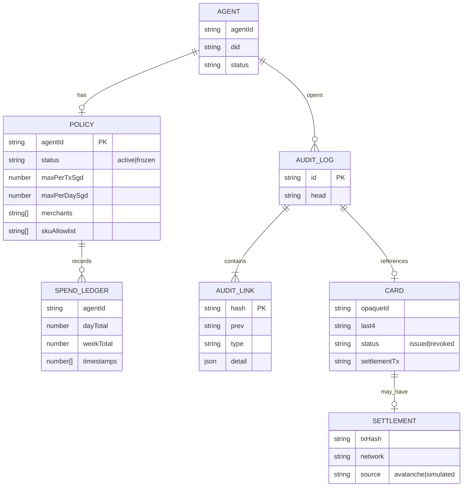

**Today:** SQLite file (`data/gatex.sqlite` via `better-sqlite3`) for audits, policies, spend ledgers.  
**AWS production target:** see §12.

---

## 11. Signed gateway requests (authN design)

Current: optional shared `GATEWAY_API_KEY` (`x-gatex-key`).  
Hire-signal next step: **per-agent signatures** so check/pay cannot be forged with a leaked org key alone.

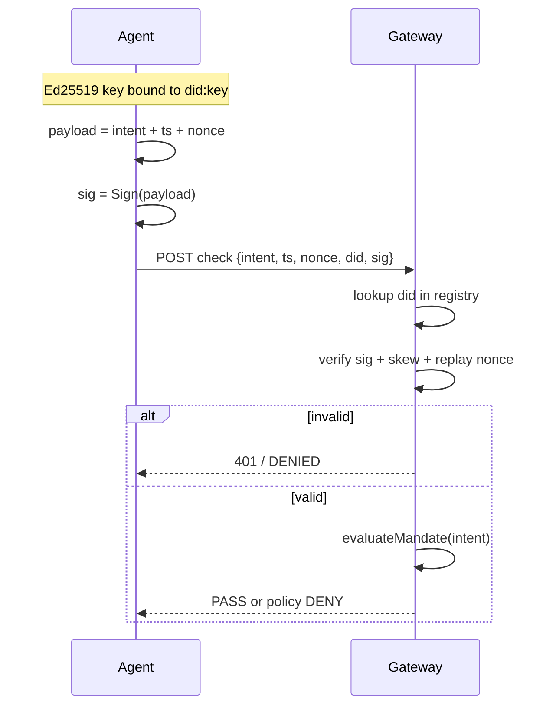

| Field | Purpose |
| --- | --- |
| `did` | Agent identity (already in `src/lib/identity`) |
| `ts` + `nonce` | Replay protection |
| `sig` | Binds intent to that DID |
| Registry | Only enrolled DIDs spend |

---

## 12. Persistence — AWS target (vs hackathon now)

**Hackathon now:** local SQLite file (`data/gatex.sqlite`); **Amplify deploy** uses in-memory (Lambda).  
**AWS-shaped production** (what you’d build next):

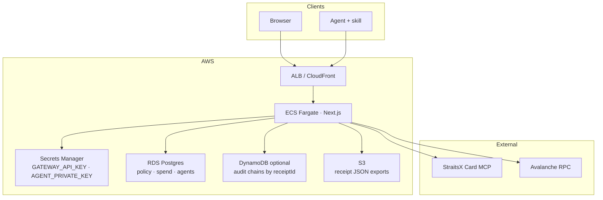

| Concern | Hackathon | AWS |
| --- | --- | --- |
| Policy / freeze | SQLite file | RDS Postgres row `policies` |
| Spend ledger | SQLite | Postgres or DynamoDB |
| Audit chain | SQLite (+ `/receipts` UI) | DynamoDB (`receiptId`, `seq`) or Postgres JSONB + S3 export |
| Secrets | `.env` | Secrets Manager |
| Compute | Amplify Hosting (SSR / memory) | ECS/Fargate or App Runner |

**Yes, you can store on AWS** — Postgres on RDS is the next step up from local SQLite. Amplify SSR uses in-memory (Lambda FS limits); document the RDS/Dynamo shape for production durability.

---

## 13. Threat model (brief)

| Threat | Mitigation in GateX |
| --- | --- |
| Spoofed agent | DID registry + (planned) signed intents |
| Prompt injection → tool | CaMeL quarantine; P-LLM never sees HTML |
| Frozen agent still pays | `evaluateMandate` / RHA refuse `FROZEN` |
| Standing card theft | One-time card + mandatory revoke |
| Double pay | Pay path should be idempotent (production: idempotency-key header) |
| Tampered receipt | `verifyChain` hash links |

---

## 14. Non-goals / honesty

- Not a custodial bank; humans fund wallets.  
- Not standing agent Visa — one-time card then revoke.  
- Business API / KYB not required for this weekend’s Card MCP path.  
- Without keys/test XSGD, responses may be labeled `simulated` while preserving protocol shape.  
- AWS diagram is the **production target** beyond the shipped SQLite file.  
